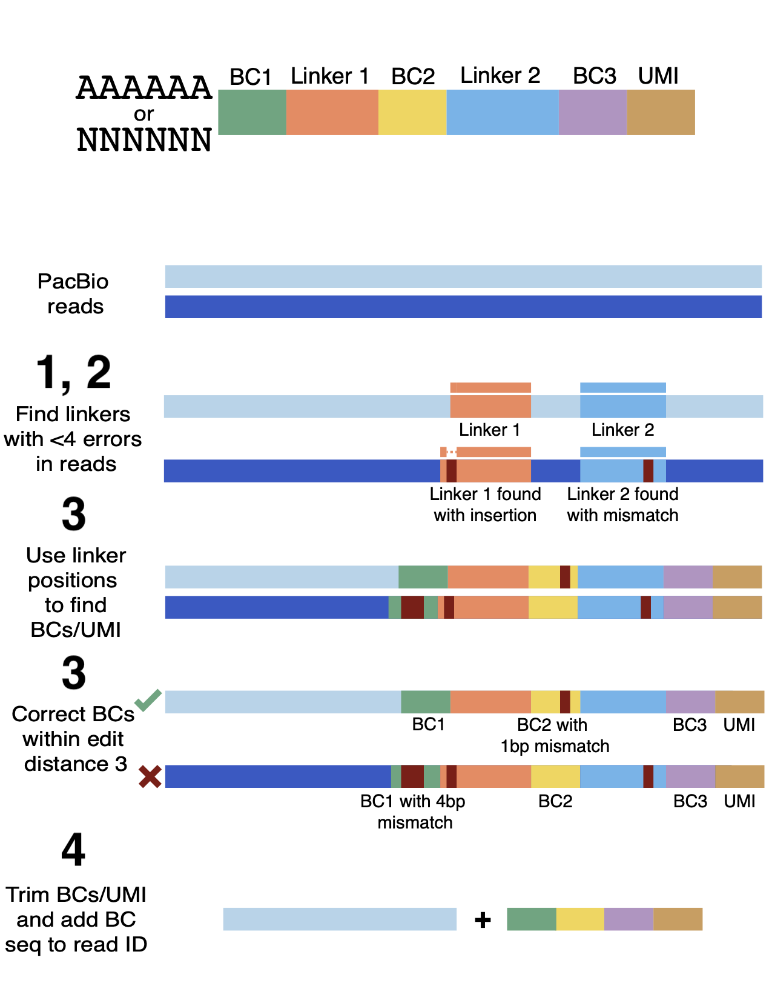

# LR-splitpipe

LR-splitpipe is a pipeline designed for demultiplexing, debarcoding, and preparing LR-Split-seq data. 

## Demultiplexing reads




To demultiplex reads for their Split-seq barcodes, use `demultiplex.py`.


```
Usage: python LR-splitpipe/demultiplex.py [options]

optional arguments:
  -h, --help      show this help message and exit
  -f FASTQ        FASTQ file output from Lima with LR-Split-seq reads.
  -steps STEPS    Comma separated list of steps to perform. Default is all.
                  Options include: score_linkers, align_linkers, correct_bcs,
                  trim, i_filt, write_fastq
  -o OPREFIX      Output file path/prefix
  -t THREADS      Number of threads to run on (multithreading is recommended)
  -i_file I_FILE  Barcodes from Illumina to filter PacBio barcodes on.
                  Default: None
```

### Demultiplexing steps:

Each step requires the prior step have been run and output from that step has been generated and is still there!

#### 1. Score linkers

First, LR-splitpipe uses alignment to find reads that have linkers in them, which are the static regions that connect each of the combinatorial barcodes. Reads that have fewer than 4 errors in each linker will then be used to find barcodes. 

`score_linkers` option for the `-steps` argument.

#### 2. Align linkers

Using the reads that had valid linkers found in them, determine the location in the read of each linker. 

`align_linkers` option for the `-steps` argument.

Note: This step typically takes the longest! Parallelization will help with this!

#### 3. Find and correct barcodes

With the locations of the linkers from step 2, extract the barcodes from each read. Correct barcodes to those that are within edit distance of 3 of the list of possible Split-seq barcodes. This step uses code and assets (barcodes and barcodes within edit distance 3) from the original [Parse Biosciences](https://www.parsebiosciences.com/) Split-seq demultiplexing code, which is designed for short reads.

`correct_bcs` option for the `-steps` argument.

#### 4. Trim barcodes

After recording the barcode and UMI for each read, trim the construct off from the sequence as this part will mess up mapping. 

`trim_bcs` option for the `-steps` argument.

#### 5. Optional filtering

If a corresponding short-read Split-seq experiment has been performed, barcodes that pass the UMI/cell cutoff in that experiment can be used to limit the corresponding barcodes in the long-read experiment. The barcodes should be given in a text file where each line corresponds to one 24nt long barcode.

`i_filt` option for the `-steps` argument.
`i_file` to specify the short-read barcodes file.

#### 6. Write to fastq

Take the barcode/UMI for each read and append it to the read name of each read. Output the trimmed reads labeled by their barcodes to a fastq file.

`write_fastq` option for the `-steps` argument.

## Adding cell barcode as BAM tag

After running the demultiplexer, reads should be mapped and converted to a SAM file. In this file format, the barcode, which is in the read header in fastq format, can be moved to a cell barcode (CB:Z:NNNNN...) tag as part of the SAM file. This is useful to be able to run [TALON](https://github.com/mortazavilab/TALON) on the single-cell data down the line. To do this, run `add_bam_tag.py`.

Note: It is recommended to use the `--merge_primers` option. This option was only included to compare the random hexamer and oligo-dT primed reads for the pilot experiment.

```
Usage: python LR-splitpipe/add_bam_tag.py [options]

  -h, --help       show this help message and exit
  -s SAMFILE       SAM file output from Minimap2/TranscriptClean with splitseq
                   barcode+UMI information in the read name
  --merge_primers  Merge reads that come from the same cell from different
                   priming strategies
  -o OPREFIX       Output file path/prefix
```
